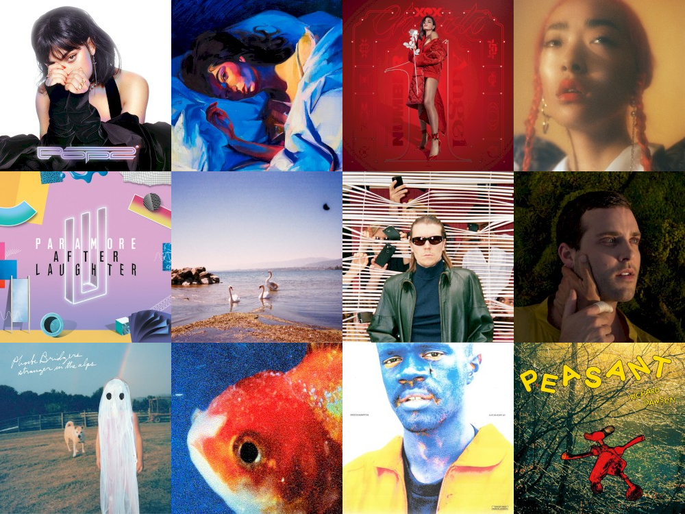

I listen to a _lot_ of music. While I will listen to some albums a
few times and move on, some stay with me. This post quantifies the
albums from 2017 that stayed in my life in 2018.

Each December, I compile [a list](https://gist.github.com/CarlColglazier/913963cc7197fb7a024d736c96545439) of my favorite recent albums from the
past year. People really enjoy reading lists, so pretty much every
music publication also releases a end-of-year list around the same
time&nbsp;[^fn:1].

As fun as it is to parse through yearly lists, liking an album is no
guarantee of future streams. Sometimes there are albums like Sufjan
Steven's _Carrie & Lowell_ which, although exceptional, are do not
exactly make the best background music for homework. Other times
I might really en joy an album on repeat for a period of time, but
I eventually move on the something else. I might get a nice feeling
of nostalgia looking back at the record and how I now associate it
with that time period, but there would be no way to replicate that
initial infatuation.

In the streaming era, my music library is sometimes a bit like a
midnight refrigerator run: there's always plenty inside, but at the
moment I might just be looking for something quick and easy. Thus this
list is probably best described as my musical comfort food. There are
the albums from 2017 I had on repeat in my head and in my ears
throughout 2018.

```R
recentAlbums %>%
	filter(str_detect(date, "2017")) %>%
	select(artist_name, release_name, n) %>%
	head(19)
```

| artist\_name     | release\_name        | n   |
|------------------|----------------------|-----|
| Charli XCX       | Pop 2                | 296 |
| Charli XCX       | Number 1 Angel       | 153 |
| GFOTY            | GFOTYBUCKS           | 144 |
| Lorde            | Melodrama            | 144 |
| Carly Rae Jepsen | EMOTION SIDE B       | 86  |
| Coma Cinema      | Loss Memory          | 85  |
| Rina Sawayama    | RINA                 | 85  |
| Paramore         | After Laughter       | 84  |
| Alex Cameron     | Forced Witness       | 77  |
| Baths            | Romaplasm            | 72  |
| Phoebe Bridgers  | Stranger in the Alps | 61  |
| Elliott Smith    | Either/Or            | 58  |
| Vince Staples    | Big Fish Theory      | 57  |
| BROCKHAMPTON     | SATURATION III       | 46  |
| Richard Dawson   | Peasant              | 41  |
| Sufjan Stevens   | Carrie & Lowell Live | 41  |
| King Krule       | The OOZ              | 37  |
| LCD Soundsystem  | american dream       | 37  |
| Arca             | Arca                 | 36  |
| Carly Rae Jepsen | EMOTION Side B       | 31  |


## The Albums {#the-albums}

Now I'll say a few words about some of the albums on this list.




### Charli XCX - _Pop 2_ {#charli-xcx-pop-2}

The prolific UK-based singer-songwriter has released a
masterpiece. Featuring production from the likes of A.G. Cook
and SOPHIE, _Pop 2_ is a celebration of future-facing pop
music with catchy hooks and hyper-glossy production.


### Lorde - _Melodrama_ {#lorde-melodrama}

I was completely blown away by this on my first listen.  Jack Antonoff
joined Lorde as executive producer and together they crafted a record
full of unexpected hooks and sleek arrangements. The fact that this
album is even being compared to Kate Bush's _Hounds of Love_ is a
testament to the songwriting chops of the young singer-songwriter.


### Charli XCX - _Number 1 Angel_ {#charli-xcx-number-1-angel}

Honestly I really wish that XCX3 got released last year as planned,
but these two mixtapes are possibly the greatest consolation prize
possible. PC Music-era Charli XCX just plain works. Perhaps the
most impressive accomplishment in these mixtapes is her ability
to feature so many other artists while at the same time not
being overshadowed in the slightest.


### Rina Sawayama - _RINA_ {#rina-sawayama-rina}

I love the sound and aesthetic of pop music from the late 90's and
early 2000's. It's hard for me to describe, but there's just a level
of confidence to it that is difficult to reproduce. While Rina
Sawayama by no means tries to replicate the sound, she channels
it perfectly in this Clarence Clarity-produced EP.


### Paramore - _After Laughter_ {#paramore-after-laughter}

Does Hayley Williams have one of the best voices in today's music
industry? Yes. Does Paramore keep getting better and better over time?
Also yes.


### Coma Cinema - _Loss Memory_ {#coma-cinema-loss-memory}

This was late release (early December) and it did not receive very
much attention from the music press. Nonetheless, I found it to be
a very enjoyable winter album with a raw yet removed approach to
its emotional subject matter.


### Alex Cameron - _Forced Witness_ {#alex-cameron-forced-witness}

Heartland synthpop drenched in irony and social commentary. Cameron
is simultaneously hilarious and thought-provoking.


### Baths - _Romaplasm_ {#baths-romaplasm}

Bubbly production and chippy songwriting. It's a concept album.
I still don't quite get the concept, but that's okay.


### Phoebe Bridgers - _Stranger in the Alps_ {#phoebe-bridgers-stranger-in-the-alps}

I didn't really get into this release until late this year.
Wow, there are some good songs in here! Another great winter
album with a lot of sad subjects, but also some intimate
and emotional arrangements.

[^fn:1]: AOTY publishes an aggregate of over a hundred end-of-year lists annually. Read their 2017 list [here](https://www.albumoftheyear.org/list/summary/2017/).